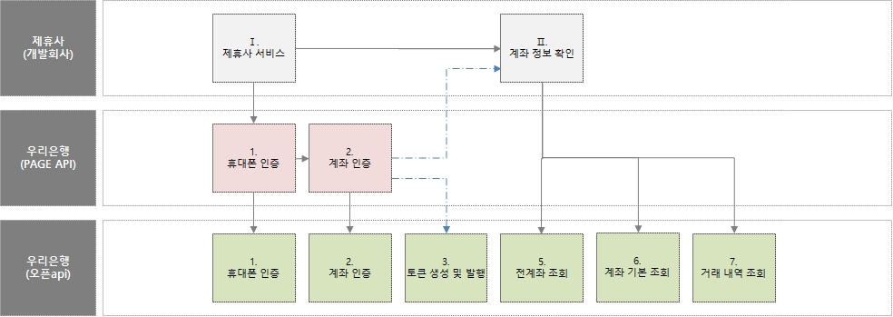

# API_Finance_Data

_2019년 06월 25일 (Ver 1.0) update for Wooribank API_

> 금융데이터조회 API서비스 관련 설명서

### 1. 금용조회 API 소개

----------

##### 1.1 목적

본 문서는 우리은행의 금융조회 API 연동을 통하여 금융조회 서비스를 활용하는데 필요한 연동 규격을 설명한다.

##### 1.2 금융조회 API 흐름도




### 2. API Spec & Example

----------

##### 2.1 계좌 조회 HTTP Request

```
GET /oai/wb/v1/finance/getIndivAllAccInfo
```

##### 2.2 Response Example 

```json
{
	"dataHeader": {
		
	},
	"dataBody": {
		"GRID_CNT": 2,
		"GRID": [{
			"ACNO": "1002146788200",
			"PDCD": "0020590000000",
			"PRD_NM": "우리급여 저축예금",
			"CUCD": "KRW",
			"PBOK_BAL": 71888,
			"WDR_AVL_AM": 0,
			"NEW_DT": "20120604",
			"LST_TRN_DT": "20190612",
			"XPR_DT": "20190612",
			"ADNT_RGS_YN": "N"
		},
		{
			"ACNO": "1002160010529",
			"PDCD": "0021650000000",
			"PRD_NM": "우리꿈 저축예금",
			"CUCD": "KRW",
			"PBOK_BAL": 0,
			"WDR_AVL_AM": 0,
			"NEW_DT": "20190524",
			"LST_TRN_DT": "20190524",
			"XPR_DT": "20190524",
			"ADNT_RGS_YN": "Y"
		}]
	}
}
```


### 3. Protocol Rule

----------

우리은행 오픈API 연동 방식은 REST(Representational State Transfer) 방식에 따라 구현한다. HTTP Method 및 리소스에 대한 URL에 따라 Request와 Response 데이터 타입은 JSOM을 사용한다.
또한 HTTP 1.1 Spec 규격을 따른다.

##### 3.1 Resource URL

우리은행 오픈API 서비스의 Request URL은 다음과 같다.
```
{HTTP_METHOD} http(s)://{host}:{port}/{directory}/{anyResource}?{Query}
```

항목 | 설명 | 비교
---- | ---- | ----
http://{host}:{port} | Host Address와 port | 	
/{directory} | Resource | /api/v1
/{anyResource}?{Query} | {anyResource}: Logical resource <br> {Query}: Parameter | 

※ 모든 데이터는 URL Encoding하여 전송해야 한다.

##### 3.2 Resource URL

우리은행의 오픈API 서비스는 기본적으로 자원 요청에 의해 리턴 되는 JSON(Content-Type: application/json) 및 HTML(Content-Type: text/html) Type만 사용한다.

##### 3.3 HTTP Method를 통한 Request Action 매핑

목록 및 상세정보 제공은 GET HTTP Method를 사용하며 수정은 PUT, PATCH를 사용하고 생성은 POST를 사용하고 삭제는 DELETE HTTP Method를 이용한다.

HTTP Method | Action | 설명 | 비고
---- | ---- | ---- | ----
GET | Read | 리소스 획득 | 
PUT | Update/Modify | 리소스 변경 | 
POST | Create/New | 리소스 생성 | 
DELETE | Delete | 리소스 삭제 | 

※ 필요에 따라 HTTP Method는 변경될 수 있음.

##### 3.4 Request HTTP Header 형태

우리은행 오픈API는 등록된 사용자 여부를 확인 하기 위하여 “appKey”와 “secretKey”를 HTTP Header에 적용하여야 하며, 인증은 OAuth 2.0을 지원하고 있다.
```
GET /oap/wb/v2/oauth/tokencheck HTTP/1.1
…
Content-Type: Applicatin/x-www-form-urlencoded
appKey: <APP Key>
Authorization: Bearer <Access Token>
…
```

##### 3.5 Response 데이터의 형태
JSON Format인 경우 다음과 같다 JSON tag의 순서는 연동규격에 작성된 순서와 다를 수 있다.
```
{
    “dataHeader”: {
        …
    },
    “dataBody”: {
        …
    },
}
```


